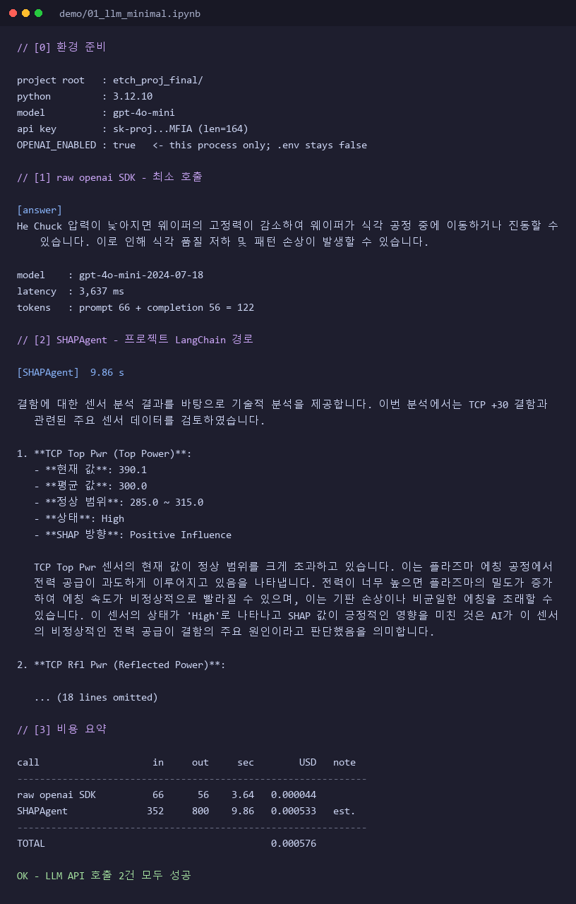
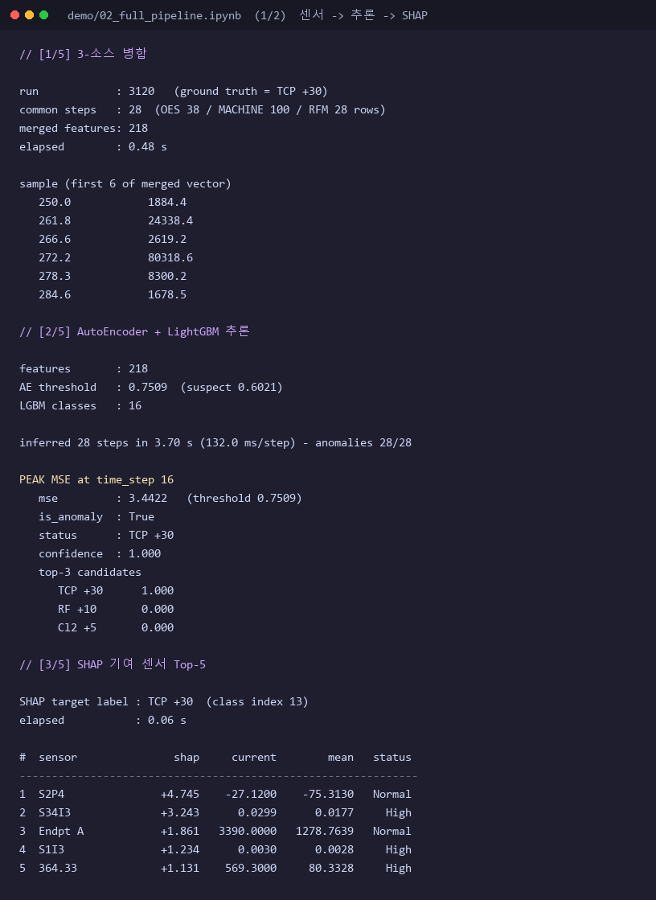
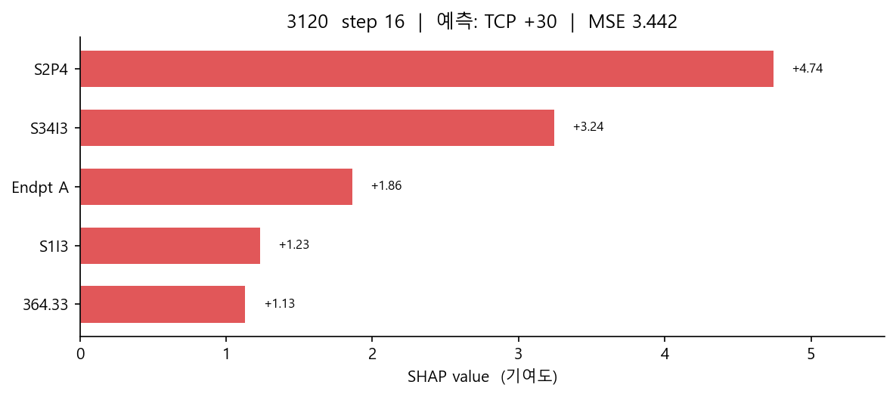
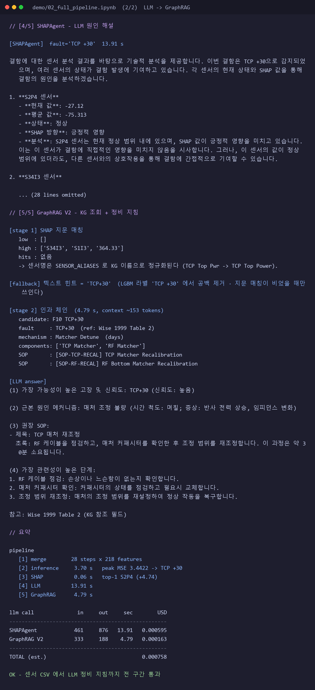
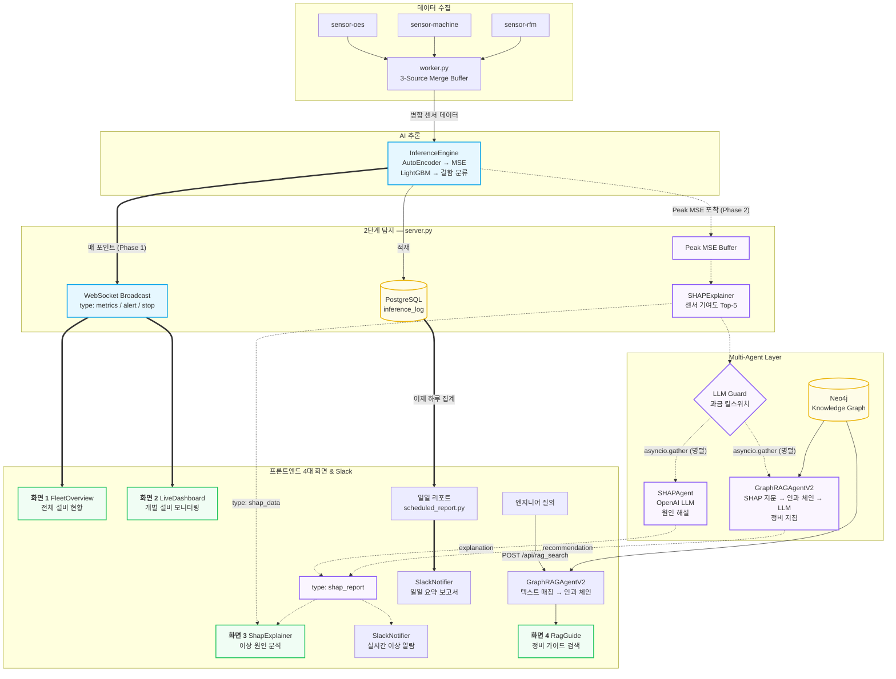

# 반도체 식각 공정 지능형 관제 시스템

Lam 9600 metal etcher 의 센서 스트림을 실시간으로 감시해
**이상 탐지 → 결함 분류 → 원인 설명 → 정비 지침**까지 자동으로 잇는 시스템이다.

숫자만 뱉는 이상 탐지에서 멈추지 않는 것이 이 프로젝트의 목표다.
AutoEncoder 가 "MSE 3.44 로 이상" 이라고 말하면, SHAP 이 "어느 센서 때문인지" 를 짚고,
LLM 이 그것을 공정 엔지니어의 언어로 풀어 쓰고, 지식그래프가 "그래서 무엇을 해야 하는지"
정비 절차를 붙인다.

---

## 구현 범위

| 영역 | 파일 |
|---|---|
| 데이터 수집 · 전처리 · 3-소스 병합 및 증강 | `kafka_streamer.py`, `data/*_integrated.csv` |
| Neo4j 지식그래프 설계 · 적재 | `graphdb/neo4j_loader_v2.py` |
| GraphRAG 검색 — SHAP 지문 매칭 + 인과 체인 2단계 | `agents/rag_agent_v2.py` |
| 에이전트 계층 · 과금 게이트 | `agents/shap_agent.py`, `agents/llm_guard.py` |
| 서버 오케스트레이션 · 2단계 탐지 | `server.py` |
| 24/7 상시 워커 · PostgreSQL 적재 | `worker.py`, `monitoring/store.py` |
| 일일 리포트 (집계 · HTML · 스케줄러) | `dags/`, `scheduled_report.py`, `run_*.bat` |
| Slack 알림, LLM 데모 노트북 | `notifications/slack.py`, `demo/` |

---

## 무엇이 실제로 동작하는가

아래 표는 이 저장소의 노트북을 **실제로 실행해서** 나온 값이다.
숫자는 [`demo/`](demo) 의 노트북에 출력이 그대로 저장되어 있고, 다시 실행하면 재현된다.

| 단계 | 구현 | 실측 |
|---|---|---|
| 3-소스 센서 병합 | OES + MACHINE + RFM → 218 features | 28 step, 0.48 s |
| 이상 탐지 | AutoEncoder 재구성 오차 | peak MSE **3.4422** (임계치 0.7509) |
| 결함 분류 | LightGBM 16 클래스 | **TCP +30**, confidence 1.000 |
| 원인 지목 | SHAP TreeExplainer | Top-1 `S2P4` (+4.74), 0.06 s |
| 원인 해설 | OpenAI `gpt-4o-mini` | 13.9 s, 한국어 기술 분석 |
| 정비 지침 | Neo4j GraphRAG + LLM | 4.8 s, `SOP-TCP-RECAL` 도출 |

LLM 호출 4건의 실제 비용은 **약 $0.0013** 이다.

---

## LLM API 호출 데모

이 저장소의 핵심 확인 항목이다. 노트북 두 개로 나뉜다.

| 노트북 | 무엇을 보이는가 | 외부 의존 |
|---|---|---|
| [`demo/01_llm_minimal.ipynb`](demo/01_llm_minimal.ipynb) | LLM API 가 살아 있는지 **최소 코드**로 증명 | OpenAI 뿐 |
| [`demo/02_full_pipeline.ipynb`](demo/02_full_pipeline.ipynb) | 센서 CSV 부터 정비 지침까지 **전 구간** | OpenAI + Neo4j |

두 노트북 모두 새 로직을 짜지 않는다. `server.py` 가 실제로 호출하는
`agents/shap_agent.py` · `agents/rag_agent_v2.py` · `inference.py` · `shap_analysis.py` 를
**그대로 불러 쓴다.** 즉 데모는 서비스가 쓰는 추론 · SHAP · LLM · GraphRAG 모듈을
재사용해 주요 동작을 확인한다. 자동 Phase 2 와 데모는 같은 GraphRAG V2 경로를 쓴다
(`shap_list_to_dict()` 로 SHAP 를 넘기고 `GraphRAGAgentV2.recommend()` 를 부른다).
다만 데모는 Kafka 없이 CSV 로 같은 경로를 재현하므로 스트리밍·워커 구간까지 확인하지는 않는다.

### 사전 준비

```bash
# 1) 의존성
pip install -r requirements.txt
pip install nbconvert          # 노트북을 CLI 로 실행할 때만 필요

# 2) .env (프로젝트 루트)
OPEN_AI_API_KEY=sk-...          # 주의: OPENAI 가 아니라 OPEN_AI
LLM_MODEL=gpt-4o-mini
NEO4J_URI=neo4j+s://xxxx.databases.neo4j.io
NEO4J_USERNAME=neo4j
NEO4J_PASSWORD=...
OPENAI_ENABLED=false            # 과금 킬 스위치 (아래 설명)
```

`.env` 는 `.gitignore` 에 등록되어 있다.

#### 과금 킬 스위치

`agents/llm_guard.py` 는 모든 LLM 에이전트의 `__init__` 에서 `OPENAI_ENABLED` 를 확인하고,
`false` 면 **에이전트 생성 자체를 막는다.**

```python
def ensure_openai_enabled() -> None:
    if not openai_enabled():
        raise OpenAIDisabledError(DISABLED_MESSAGE)
```

호출 지점마다 `if` 를 다는 방식은 빠뜨리기 쉬워서, 생성자 한 곳에서 차단한다.

플래그는 두 개이고 **코드 기본값과 이 저장소 `.env` 설정이 다르다.**

| 플래그 | 코드 기본값 (`getenv`) | 이 저장소 `.env` | 역할 |
|---|---|---|---|
| `OPENAI_ENABLED` | `true` — 미설정 시 허용 | `false` | 총괄 킬 스위치 |
| `LLM_ANALYSIS_ENABLED` | `false` | `false` | 실시간 자동 원인 분석 |

24/7 워커가 무인으로 도는 환경이라 `.env` 에서 둘 다 꺼 뒀다 — **버그가 아니라 의도된 설정이다.**
실시간 경로에서 LLM 이 호출되려면 둘 다 `true` 여야 한다.

데모 노트북은 `.env` 를 고치지 않는다. 대신 자기 프로세스에서만 스위치를 올린다.

```python
# load_dotenv() 는 이미 설정된 환경변수를 덮어쓰지 않는다.
# 그래서 이 한 줄을 먼저 실행하면 .env 는 false 로 남은 채 이 프로세스만 열린다.
os.environ["OPENAI_ENABLED"] = "true"
from dotenv import load_dotenv
load_dotenv()
```

### 실행

```bash
# 노트북으로 열어서 Run All  (VS Code / JupyterLab)
demo/01_llm_minimal.ipynb
demo/02_full_pipeline.ipynb

# 또는 CLI 로 실행해 출력을 노트북에 저장
jupyter nbconvert --to notebook --execute --inplace demo/01_llm_minimal.ipynb
jupyter nbconvert --to notebook --execute --inplace demo/02_full_pipeline.ipynb

# 실행 결과를 README 용 이미지로 다시 그리기
python demo/render_screenshot.py
```

---

### 데모 1 — LLM API 최소 동작

두 경로를 차례로 호출한다.

1. **raw `openai` SDK** — LangChain·Neo4j·모델 파일 전부 빼고 HTTP 한 번.
   여기서 실패하면 나머지는 볼 필요가 없다.
2. **`SHAPAgent`** — 서비스가 실제로 쓰는 LangChain 체인.
   입력은 `SHAPExplainer.explain()` 이 내보내는 것과 같은 형식의 고정 샘플이다.

```python
from openai import OpenAI
client = OpenAI()
resp = client.chat.completions.create(
    model=MODEL, temperature=0,
    messages=[
        {"role": "system", "content": "너는 반도체 플라즈마 식각 공정 엔지니어다. 두 문장 이내로 답한다."},
        {"role": "user",   "content": "식각 챔버에서 He Chuck 압력이 정상보다 낮아지면 웨이퍼에 어떤 문제가 생기나?"},
    ],
)
```



API 키는 마스킹해서 찍고, `OPENAI_ENABLED` 가 이 프로세스에서만 `true` 인 것을 확인할 수 있다.
`gpt-4o-mini-2024-07-18` 이 122 토큰으로 응답했고, 이어서 `SHAPAgent` 가 한국어 기술 해설을 냈다.

---

### 데모 2 — 센서 CSV 부터 정비 지침까지

운영 시스템은 Kafka 로 센서를 받지만, 이 노트북은 **브로커 없이 CSV 로 같은 경로를 재현**한다.

```
data/*.csv  ──[1]──▶  3-소스 병합 (218 features)
                            │
                          [2]  InferenceEngine  (AutoEncoder MSE + LightGBM 분류)
                            │  run 전 구간 중 Peak MSE 시점 포착
                            │
                          [3]  SHAPExplainer    (TreeExplainer → 기여 센서 Top-5)
                            │
              ┌─────────────┴─────────────┐
            [4] SHAPAgent               [5] GraphRAGAgentV2
                OpenAI LLM                  Neo4j KG → OpenAI LLM
                원인 해설                    정비 SOP 권고
```

각 단계는 `server.py` 의 실제 코드 경로를 그대로 따른다.

| 단계 | 재현하는 코드 |
|---|---|
| [1] | `kafka_streamer.py` 의 메타 컬럼 제외 + `worker.py` 의 3-소스 `dict.update` 병합 |
| [2] | `server.load_ai_engines()` 와 같은 인자로 `InferenceEngine` 생성, Phase 2 의 Peak MSE 버퍼 |
| [3] | `server._run_anomaly_pipeline()` 의 `pred_idx` 결정 → `scaler.transform` → `explain` |
| [4] | `server._call_shap_agent()` |
| [5] | `server._call_rag_v2()` — 자동 Phase 2 와 공용 |

#### 앞단 — 병합 · 추론 · SHAP



28 개 공통 time_step 중 **step 16 에서 MSE 가 3.4422** 로 튀었다.
임계치 0.7509 의 4.6배다. LightGBM 은 이를 `TCP +30` 으로 confidence 1.000 에 분류했고,
데이터의 ground truth 와 일치한다.

같은 시점의 SHAP 기여도를 프론트엔드 화면 3 과 같은 그림으로 그리면 이렇다.



#### 뒷단 — LLM 해설 · GraphRAG 정비 지침



GraphRAG 는 지식그래프에서 인과 체인을 먼저 끌어온 뒤 그것을 근거로 답을 쓴다.

```
Fault: TCP+30  (ref: Wise 1999 Table 2)
   └─ CAUSED_BY ──▶ Mechanism: Matcher Detune  (timescale: days)
                       ├─ DEGRADES ─────▶ Component: TCP Matcher, RF Matcher
                       └─ REMEDIATED_BY ▶ SOP: SOP-TCP-RECAL  TCP Matcher Recalibration
                                               SOP-RF-RECAL   RF Bottom Matcher Recalibration
```

LLM 에 넘어간 컨텍스트는 약 153 토큰이다. SOP 전문 대신 요약(abstract)만 넣고,
전체 절차는 사용자가 요청할 때만 가져오는 2단계 검색 설계 덕분이다.

---

## 아키텍처



### 2단계 탐지가 필요한 이유

LLM 호출은 초 단위가 걸린다. 그걸 실시간 경로에 넣으면 대시보드가 멈춘다.
그래서 경로를 둘로 나눈다.

- **Phase 1 (< 100 ms, LLM 없음)** — 매 데이터 포인트마다 MSE·상태를 WebSocket 으로 방송.
  화면은 즉시 "🚨 이상 감지 (원인 분석 중...)" 을 띄운다.
- **Phase 2 (수 초, LLM 호출)** — run 이 끝나거나 설비가 멈추면, 그 run 에서 **MSE 가 가장 컸던 시점**
  하나만 골라 SHAP → LLM → GraphRAG 를 돌린다. 백그라운드 태스크라 스트리밍을 막지 않는다.

두 에이전트는 `asyncio.gather(return_exceptions=True)` 로 병렬 호출한다.
`return_exceptions=True` 가 핵심이다 — Neo4j Aura 는 원격이라 간헐적으로 실패하는데,
그때 SHAP 원인 분석 결과까지 함께 버려지면 안 된다.

---

## 데이터와 모델

### 입력 — 3개 계측 시스템

| 소스 | 파일 | 센서 | 예시 |
|---|---|---|---|
| OES | `data/OES_integrated.csv` | 129 | 플라즈마 발광 파장별 강도 (250.0 ~ 791.5 nm × 3 구간) |
| RFM | `data/RFM_integrated.csv` | 70 | RF 전압·전류·전력 하모닉 (`S1V1` ~ `S34I5`) |
| MACHINE | `data/MACHINE_integrated.csv` | 19 | `BCl3 Flow`, `TCP Top Pwr`, `He Press`, `Pressure`, `Vat Valve` … |

세 소스를 `(Run_Name, Time_Step)` 으로 맞추면 **218차원 벡터** 하나가 된다.
데이터셋에는 정상 104 run 과 20종의 결함 run 이 들어 있다.

### 모델 (`models/`)

| 파일 | 역할 |
|---|---|
| `autoencoder.pth` | 218 → 64 → 32 → 16 → 32 → 64 → 218. 재구성 오차(MSE)로 이상 판정. 임계치 0.7509 (suspect 0.6021) |
| `lightgbm_model.joblib` | 16개 결함 클래스 분류 (`TCP +30`, `He Chuck`, `Pr -2`, `Cl2 +5`, `Normal` …) |
| `scaler.joblib` | StandardScaler |
| `label_encoder.joblib` | 클래스 라벨 인코더 |
| `sensor_stats.json` | 센서별 평균·정상범위 — SHAP 결과에 High/Low 판정을 붙이는 데 쓴다 |

판정은 단순 임계치 비교가 아니라 **AE 와 LightGBM 을 교차**한다
(`inference.py` 의 5단계 로직). AE 가 확실히 이상이면 LightGBM 신뢰도 0.5 만 넘어도 그 결함으로 인정하고,
AE 가 애매한 suspect 구간이면 0.6, AE 가 정상이라 해도 LightGBM 이 0.85 이상 확신하면 이상으로 올린다.

### 지식그래프 (Neo4j)

노드 116개, SOP 5건. Wise 1999 의 Lam 9600 결함 카탈로그를 그래프로 옮긴 것이다.

```
Equipment → Process → ProcessStep
Fault ─BELONGS_TO→ FaultCategory
Fault ─CAUSED_BY→ Mechanism ─DEGRADES→ Component
                     └─REMEDIATED_BY→ SOP ─HAS_STEP→ SOPStep
VirtualSensorModel ─PREDICTS→ WaferState ─INDICATES→ FaultRisk
```

각 `Fault` 는 `sensors_low` / `sensors_high` 지문을 갖는다.
`GraphRAGAgentV2` 는 SHAP 상위 센서를 이 지문과 대조해 결함 후보를 먼저 좁힌 뒤(coarse),
상위 후보에 대해서만 인과 체인을 따라간다(fine).

---

## 전체 시스템 실행

### 1. 인프라

```bash
docker compose up -d          # Kafka + Zookeeper + Kafka UI + Neo4j + PostgreSQL
```

| 서비스 | 포트 |
|---|---|
| Kafka | 9092 |
| Kafka UI | 8989 |
| Neo4j | 7474 (브라우저) / 7687 (bolt) |
| PostgreSQL | 5432 |

### 2. 지식그래프 적재

```bash
python graphdb/neo4j_loader_v2.py
```

### 3. 백엔드 + 상시 워커

```bash
python server.py              # FastAPI, http://localhost:8000
```

`server.py` 는 기동 시 모델을 올리고 `worker.py` 의 상시 워커를 함께 띄운다.
워커는 브라우저 접속자가 0명이어도 Kafka 를 계속 소비하며 PostgreSQL 에 적재한다.

| 엔드포인트 | 용도 |
|---|---|
| `WS /ws/stream` | 실시간 메트릭 · 알림 · SHAP · LLM 리포트 방송 |
| `POST /api/rag_search` | 정비 가이드 검색 (GraphRAG V2) |
| `GET /api/system_status` | Kafka · Neo4j · Postgres · LLM 상태 |
| `GET /reports/latest` | 최신 일일 리포트 HTML |
| `GET /health` | 헬스체크 |

### 4. 센서 스트리머

```bash
python kafka_streamer.py      # CSV → 3개 Kafka 토픽으로 발행 (공장 시뮬레이션)
```

### 5. 프론트엔드

```bash
cd frontend && npm install && npm run dev
```

화면 4개: `FleetOverview`(전체 설비) · `LiveDashboard`(개별 설비) ·
`ShapExplainer`(원인 분석) · `RagGuide`(정비 가이드 검색).

### 6. 일일 리포트

```bash
python scheduled_report.py                # 어제 하루 집계 → Slack 발송
python scheduled_report.py 2026-07-24     # 특정 날짜
python scheduled_report.py --no-slack     # 발송 없이 콘솔 출력 (배선 테스트)
```

Windows 작업 스케줄러 등록용 배치가 함께 있다
(`run_server.bat`, `run_streamer.bat`, `run_daily_report.bat` / `Etch*.xml`).

---

## 디렉터리 구조

```
etch_proj_final/
├── README.md
├── demo/                       # ← LLM 데모 (이 문서의 핵심)
│   ├── 01_llm_minimal.ipynb        LLM API 최소 호출
│   ├── 02_full_pipeline.ipynb      센서 → 추론 → SHAP → LLM → GraphRAG
│   └── render_screenshot.py        노트북 출력 → README 이미지
├── docs/images/                # 실행 스크린샷
│
├── server.py                   # FastAPI 허브: WebSocket + 2단계 탐지 + 에이전트 오케스트레이션
├── worker.py                   # 24/7 Kafka 소비 → 3-소스 병합 → 추론
├── kafka_streamer.py           # CSV → Kafka 3토픽 발행
├── inference.py                # AutoEncoder + LightGBM 추론 엔진
├── shap_analysis.py            # TreeExplainer 기여도 산출
│
├── agents/
│   ├── llm_guard.py            # OpenAI 과금 총괄 킬 스위치
│   ├── shap_agent.py           # SHAP → LLM 한국어 원인 해설
│   └── rag_agent_v2.py         # GraphRAG (자동·수동·검증 모두 사용)
│                               #   SENSOR_ALIASES · shap_list_to_dict 포함
│
├── graphdb/neo4j_loader_v2.py  # 지식그래프 적재
├── monitoring/store.py         # PostgreSQL inference_log 적재
├── notifications/slack.py      # Slack Webhook (실시간 알람 + 일일 리포트)
├── dags/report_utils.py        # 일일 집계 SQL + 리포트 포맷
├── validation/                 # 모델·RAG·데이터 품질 평가 스크립트
├── frontend/                   # React + Vite 대시보드 (4화면)
├── models/  data/  reports/  logs/
└── docker-compose.yml
```

---

## 알려진 제약

정직하게 적어 둔다. 아래는 **이번 데모 작업에서 고치지 않은 것**들이다.

### 1. 센서 지문만으로는 결함 등급을 가르지 못한다

KG 의 결함 21종 중 **서로 다른 지문은 12종뿐**이다. `sensors_high = ["TCP Top Power"]` 하나에
F01(TCP+50) · F05(TCP+10) · F10(TCP+30) · F21(TCP+20)이 모두 걸려 Stage-1 스코어
(`hits / fp_size`)가 넷 다 `1.00` 동점이 된다. 실제 조회로 확인한 결과다.

```
[TCP Top Pwr High]  정규화 high: ['TCP Top Power']
  F01 TCP+50  score=1.00      F05 TCP+10  score=1.00
  F10 TCP+30  score=1.00      F21 TCP+20  score=1.00
```

Stage-1 은 결함군까지만 좁힌다. 등급까지 가르려면 지문이 아니라 **편차 크기**가 필요하다.

### 2. OES · RFM 센서는 지문 매칭에 쓰이지 않는다

KG 에는 MSS 센서 19개만 노드로 있다. OES 파장(`364.33`)과 RFM 하모닉(`S2P4`)에 대응하는
노드가 없어 정규화를 그대로 통과한 뒤 매칭에서 탈락한다. 218개 피처 중 지문에 실제로 쓰이는
것은 7개(`TCP Top Power` · `RF Bottom Power` · `Chamber Pressure` · `Vat Valve` ·
`BCl3 Flow` · `Cl2 Flow` · `Helium Pressure`)다.

### 3. 운영상 주의

- **Neo4j Aura 무료 인스턴스는 유휴 시 자동 일시정지**된다. 데모 전에 resume 이 필요하다.
- `.env` 에서 `OPENAI_ENABLED` 와 `LLM_ANALYSIS_ENABLED` 를 둘 다 `false` 로 두고 있다.
  `OPENAI_ENABLED` 의 **코드 기본값은 `true`**(미설정 시 허용)이므로 `.env` 설정이 이를 덮는 것이다.
  24/7 무인 운영에서 요금이 쌓이지 않게 하려는 설정이다. `.env` 를 고쳤으면 **서버를 재시작**해야
  반영된다 (`load_dotenv` 는 프로세스 시작 시 1회만 읽는다).

---

## 참고 문헌

- Wise et al. (1999) — Lam 9600 metal etcher 결함 카탈로그. `Fault` 노드의 `reference` 필드 근거
- Sofge (1997) — 가상 센서 모델(g model), 웨이퍼 상태 예측
- Edge et al. (2024) — Microsoft GraphRAG. V2 의 coarse-to-fine 검색 패턴 근거
